.. _setting-up-device:

Configuration
#############

The device can operate in two modes and must be in ``configuration mode`` in order for the web 
server to be active. The device (esp) LED will flash slowly or show blue color when the device 
is in configuration mode. If the LED is constantly or show white color then the device is in 
WIFI setup mode. Some boards have a LED that can change color.

One of the following conditions will place the device in ``configuration mode``:

- Sleep mode has been disabled in the web interface
- Charger connected >4.15V (or the value that is configured). This does not work on the Floaty variant due to lack of hardware support.
- The two designated GPIO pins are connected

Home page 
=========

URL: (http://pressmon.local)

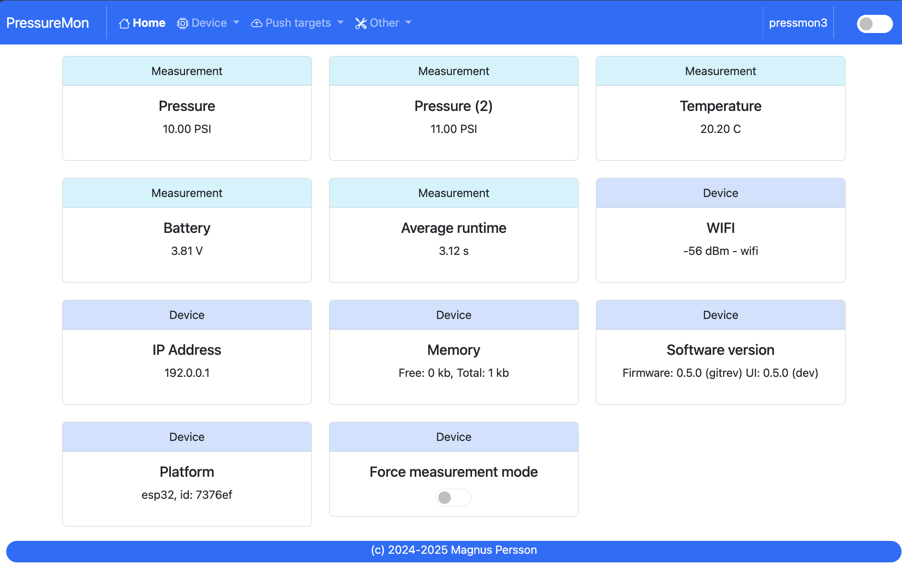

Configuration is accessed by entering the URL for the device, this will be the mDNS name *device.local* or the IP address. The following 
chapter assumes the device name is *pressmon*.

If the device is not fully configured or there are some hardware issues then these will be visible on the main page. If there are things to 
adress this will be indicated in the meny using a red dot.

The main page shows the device readings; pressure, temperature and battery charge. If the checkbox is active then the device will 
never go into sleep mode. If this is unchecked the device will change mode as explained before.

You can also view the average time a pressure measurement takes. Under optimal setting this should be around 1.5 - 2.0 seconds. If this 
is higher than 2 seconds this is most likely connected to slow wifi connection. It will show 0 if data has not been collected yet.

.. tip::

  If you are connected to the device via a serial console (speed: 115200) you can see the connection sequence and get the Unique 
  ID and IP address from there. 

Device 
======

Device - Settings
+++++++++++++++++

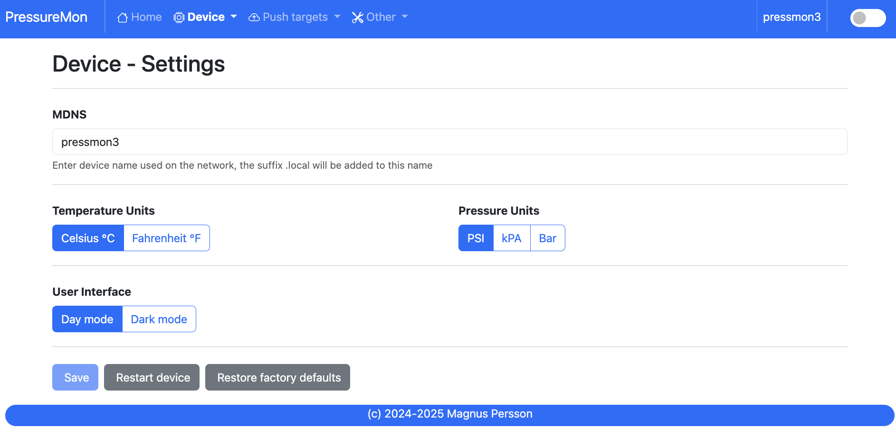

* **MDNS:** 

  This is unique name for the device. It will be used in pushing data as well as mDNS name on the network (<name>.local). 
  The limitation is 63 chars but using long names might break endpoints that data is sent to if they have other limitations. 

* **Temperature format:** 

  Choose between Celsius and Fahrenheit when displaying temperature. 

* **Pressure format:**

  Pressure format can be either `PSI`, `Bar` or `kPa`. The device will use PSI Internally and convert to other when displaying or sending data.

* **Dark Mode:**

  Switches the UI between light and dark mode. You can also use the toggle on the menubar for that.

* **Factory default**

  This function will reset all settings to factory default. Use with caution!

* **Restart**

  Restarts the device, similar to pressing the reset button

Device - Hardware
+++++++++++++++++

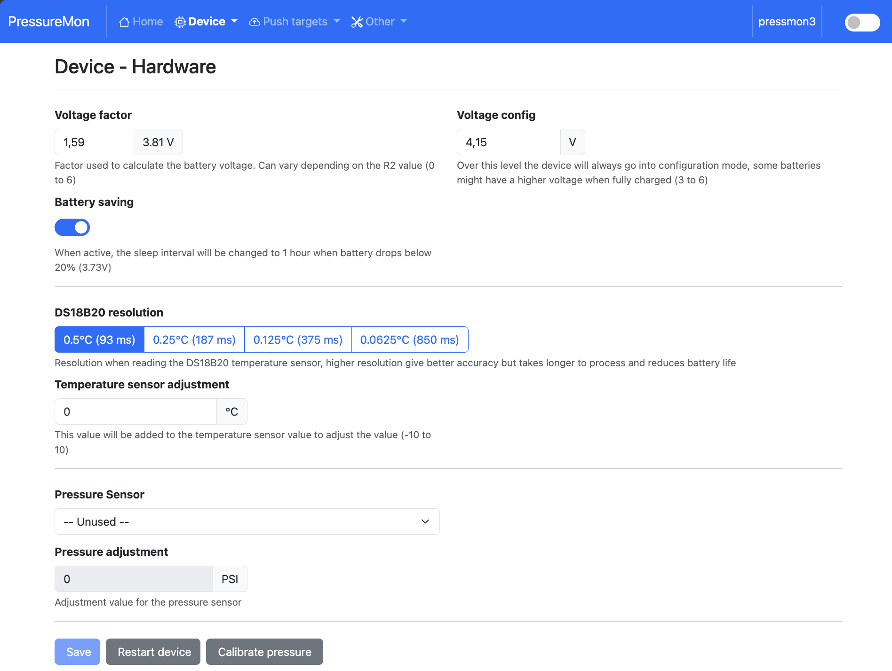

* **Voltage factor:**

  Factor used to calculate the battery voltage. If you get a too low/high voltage you can adjust this value.

* **Config voltage:**

  Defines the level of voltage when the device should enter config mode due to charging. This might vary between different battery manufacturers. 
  If you don't what the device to go into configuration mode when charging, set this to 6V. This was added since different batteries have different 
  voltages when fully charged. 

* **Battery saving:**

  If this option is checked the sleep interval will be changed to 1 hour when battery drops below 20%. Default = on. 

* **DS18B20 Resolution:**

  Define the resolution used on the temp sensor. 9 bits is default and will give an accuracy of 0.5C and and provide longest batterylife. See 
  data below from the datasheet.

  - 9 bits = 0.5°C, up to 93 ms reading
  - 10 bits =0.25°C, up to 187 ms reading
  - 11 bits = 0.125°C, up to 375 ms reading
  - 12 bits = 0.0625°C, up to 850 ms reading

* **Temperature sensor adjustment:**

  This value will be added to the temperature reading (negative value will reduce temperature reading). This is applied
  when the device starts. So changing this will not take affect until the device is restarted.

* **Battery type:**

  Choose the type of battery beeing used, LiPo or LithiumIon (18650). These are both supported by the charging module but have 
  different characteristics when calculating remaning voltage. 

* **Pressure Sensor:**

  Choose the pressure sensor that will be used 

* **Pressure calibration values:** 

  This can be used to calibrate the pressure sensor so it shows the delta pressure.

* **Analog sensor MinV:** 

  When using a custom analog sensor enter the voltage that corresponds to the min pressure in kPa.

* **Analog sensor MaxV:** 

  When using a custom analog sensor enter the voltage that corresponds to the max pressure in kPa.

* **Analog sensor Min Pressure (kPA):** 

  When using a custom analog sensor enter the min pressure in kPa.

* **Analog sensor Max Pressure (kPA):** 

  When using a custom analog sensor enter the max pressure in kPa.

Device - WIFI
+++++++++++++

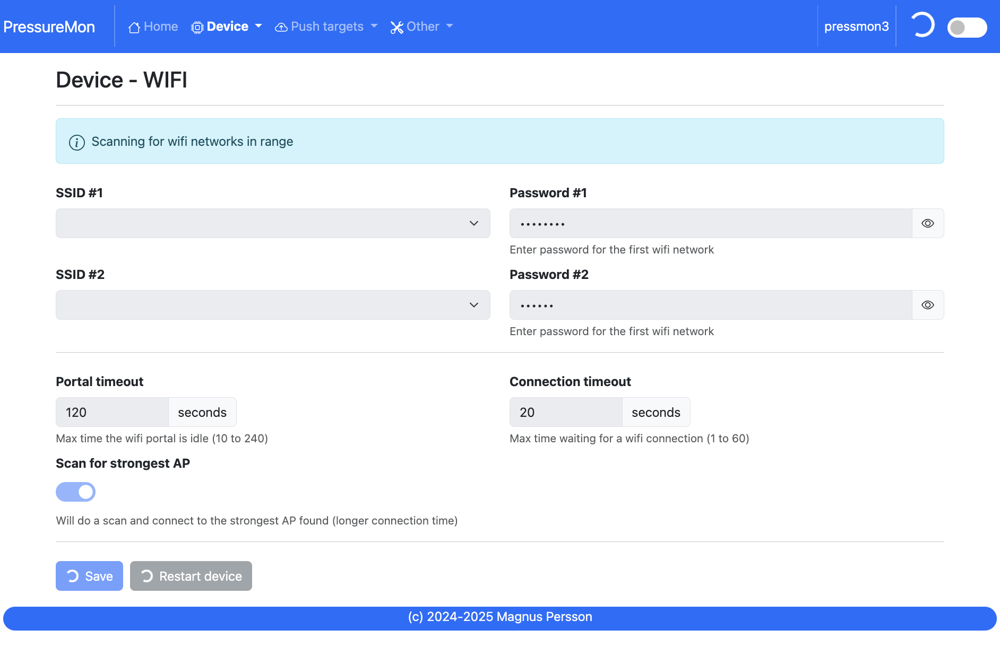

* **SSID #1:**

  Select the desired primary SSID to use. 

* **Password #1:**

  Enter the primary password. 

* **SSID #2:**

  Select the desired secondary SSID to use (optional). 

* **Password #2:**

  Enter the secondary password (optional). 

* **Portal timeout:**

  If the wifi portal is triggered (can be triggered by tapping the reset button 2-3 times within 3 seconds) then this is the amount of time allowed before it exists again.

* **Connect timeout:**

  This is the amount of time allowed for a wifi connect. 
   

Push targets
============

Push - Settings
+++++++++++++++

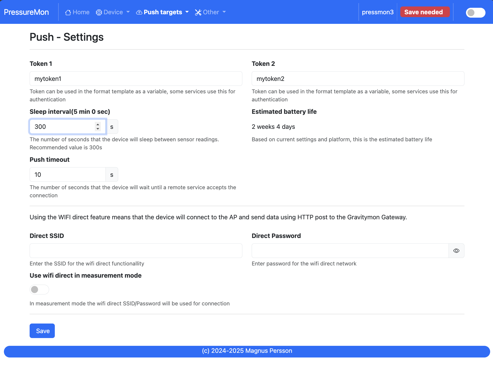

* **Token 1:**

  The token is included in the iSpindle JSON format and will be used for both HTTP targets. If you 
  need to have 2 different tokens you can customize the data format. 

* **Token 2:**

  The token is included in the default format for the HTTP GET url but can be used for any of the formats. 
  For HTTP GET use can use this for an authorization token with ubidots api. 

* **Sleep Interval:** 

  This defines how long the device should be sleeping between the readings when in `gravity monitoring` mode. You will also see 
  the values in minutes/seconds to easier set the interval. 900s is a recommended interval.  The sleep interval can 
  be set between 10 - 3600 seconds (60 minutes). 

  .. note::

    A low value such as 30s will give a lifespan of 1-2 weeks and 300s (5 min) would last for 3+ weeks. This assumes that 
    there is good wifi connection that takes less than 1s to reconnect. Poor wifi connection is the main reason for battery drain. 
    The device will show the estimated lifespan based on the average connection time, if no data exist it will not be shown.

* **WIFI Direct SSID:** 

  This WIFI SSID will be used during gravity mode to send data to the GravityMon Gateway.

* **WIFI Direct Password:** 

  This WIFI Password will be used during gravity mode to send data to the GravityMon Gateway.

* **Use WIFI Direct in gravity mode:** 

  Enabling this feature will disable all other push target settings and data will be sent to the gateway in a pre-defined format (iSpindle format) when in `gravity monitoring` mode.

* **Estimated battery life:** 

  Based on the hardware and the historical execution time the device will estimate how long it can run on a full battery
  with the current interval.

* **Push timeout:** 

  How long the device will wait for a connection accept from the remote service.

Push - HTTP Post
++++++++++++++++

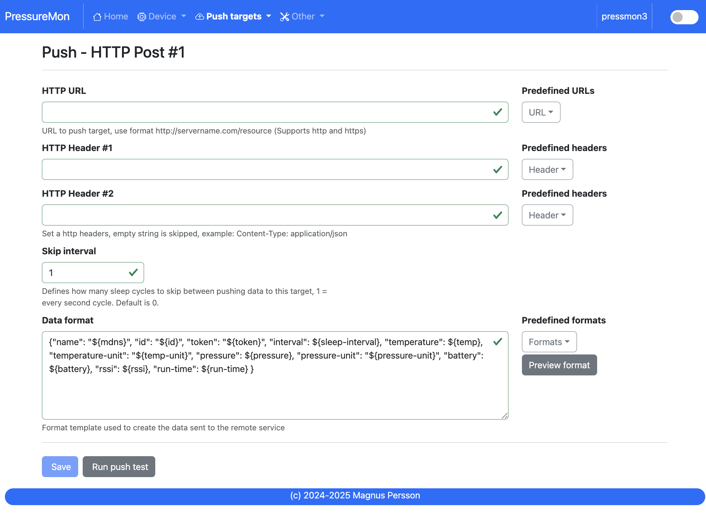

* **HTTP URL:**

  Endpoint to send data via http. You can customize the format below.

  If you add the prefix `https://` then the device will use SSL when sending data.

* **HTTP Headers** 

  You can define 2 http headers. Enter a value or just select one from the list.

  The input must have the format **'<header>: <value>'** for it to work. The UI will accept any value so errors 
  will not show until the device tries to push data.

  ::
   
    Content-Type: application/json
    X-Auth-Token: <api-token>

  Mozilla has a good guide on what headers are valid; `HTTP Headers <https://developer.mozilla.org/en-US/docs/Web/HTTP/Headers>`_ 

* **Skip Interval:**

  These options allow the user to have variable push intervals for the different endpoints. 0 means that every wakeup will send data 
  to that endpoint. If you enter another number then that defines how many sleep cycles will be skipped for this target.

* **Data format:**

  Here you can customize the data format used when sending data to the server. You can either enter your own formula or choose one
  from the list. For more information on this topic, see :ref:`format-template`. 
  
  .. note::

    If you right click in this field a list of available variables will be shown.

Push - HTTP Get
+++++++++++++++

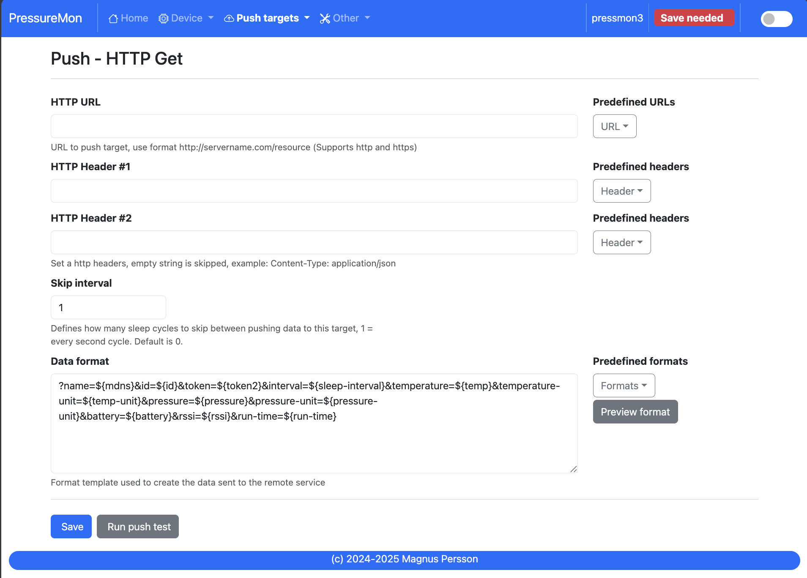

* **HTTP URL:**

  Endpoint to send data via http. You can customize the format below.

  If you add the prefix `https://` then the device will use SSL when sending data.

* **HTTP Headers** 

  You can define 2 http headers. Enter a value or just select one from the list.

  The input must have the format **'<header>: <value>'** for it to work. The UI will accept any value so errors 
  will not show until the device tries to push data.

  ::
   
    Content-Type: application/json
    X-Auth-Token: <api-token>

  Mozilla has a good guide on what headers are valid; `HTTP Headers <https://developer.mozilla.org/en-US/docs/Web/HTTP/Headers>`_ 

* **Skip Interval:**

  These options allow the user to have variable push intervals for the different endpoints. 0 means that every wakeup will send data 
  to that endpoint. If you enter another number then that defines how many sleep cycles will be skipped for this target.

* **Data format:**

  Here you can customize the data format used when sending data to the server. You can either enter your own formula or choose one
  from the list. For more information on this topic, see :ref:`format-template`. 
  
  .. note::

    If you right click in this field a list of available variables will be shown.

Push - InfluxDB v2
++++++++++++++++++

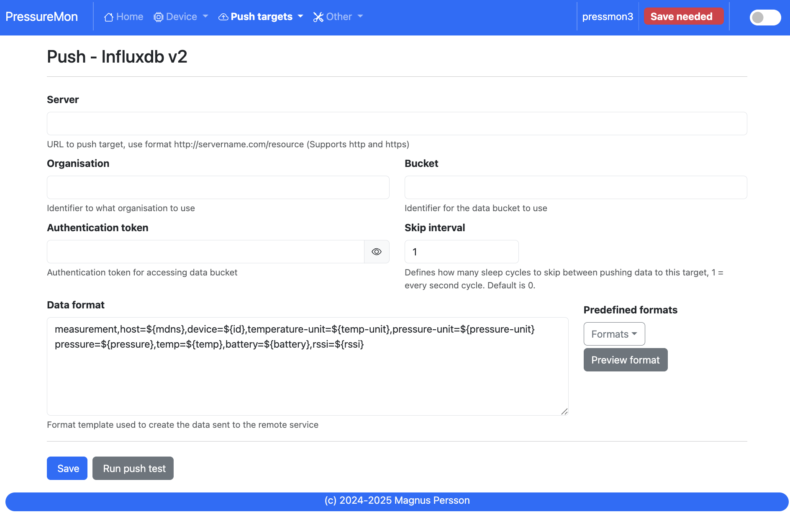

* **Server:**

  Endpoint to send data via http to InfluxDB. You can customize the format using :ref:`format-template`.

  SSL is not supported for this target. Raise a issue on github if this is wanted.

* **Organisation:**

  Name of organisation in Influx.

* **Bucket:**

  Token for bucket. Don't use the bucket name.

* **Authentication Token:**

  Token with write access to bucket.

* **Skip Interval:**

  These options allow the user to have variable push intervals for the different endpoints. 0 means that every wakeup will send data 
  to that endpoint. If you enter another number then that defines how many sleep cycles will be skipped for this target.

* **Data format:**

  Here you can customize the data format used when sending data to the server. You can either enter your own formula or choose one
  from the list. For more information on this topic, see :ref:`format-template`. 
  
  .. note::

    If you right click in this field a list of available variables will be shown.

Push - MQTT
+++++++++++

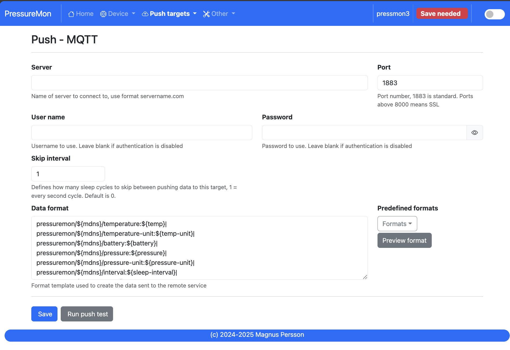

* **Server:**

  IP or name of server to send data to. You can customize the format using :ref:`format-template`.

* **Port:**

  Which port should be used for communication, default is 1883 (standard port). For SSL use 8883 (any port over 8000 is treated as SSL). 

* **User name:**

  Username or blank if anonymous is accepted

* **Password:**

  Password or blank if anonymous is accepted

* **Skip Interval:**

  These options allow the user to have variable push intervals for the different endpoints. 0 means that every wakeup will send data 
  to that endpoint. If you enter another number then that defines how many sleep cycles will be skipped for this target.

* **Data format:**

  Here you can customize the data format used when sending data to the server. You can either enter your own formula or choose one
  from the list. For more information on this topic, see :ref:`format-template`. 
  
  .. note::

    If you right click in this field a list of available variables will be shown.

Push - Bluetooth
++++++++++++++++

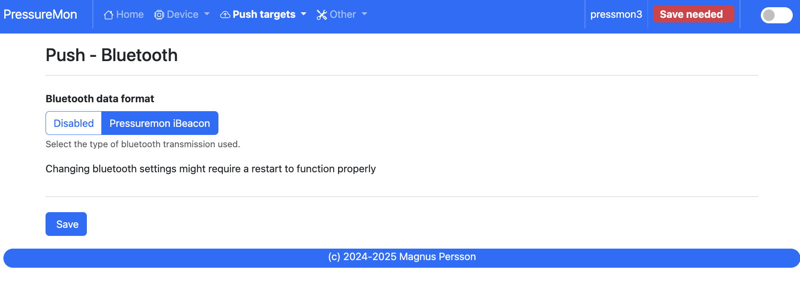

* **Bluetooth data format: (Only boards with BLE support)**

  Choose the bluetooth transmission to use.

  - **PM iBeacon**: Higher accuracy. Data: Pressure, Temperature, ID
  - **PM EDDYSTONE**: Beacon format that requires active scanning by the client. Data: Pressure, ID, Temperature 

Other
=====

Other - Serial
++++++++++++++

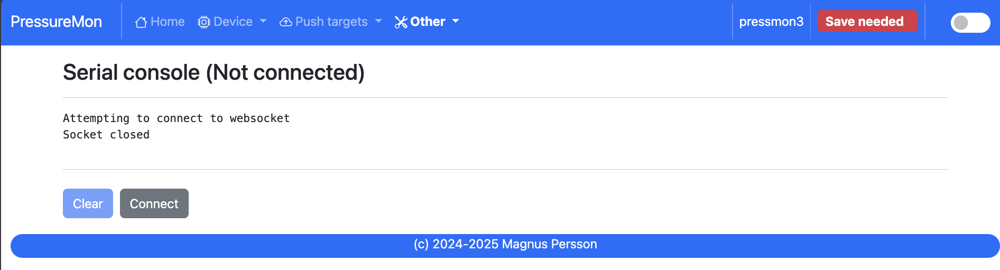

Connects to the device and shows the serial output, useful for debugging.

Other - Backup
++++++++++++++

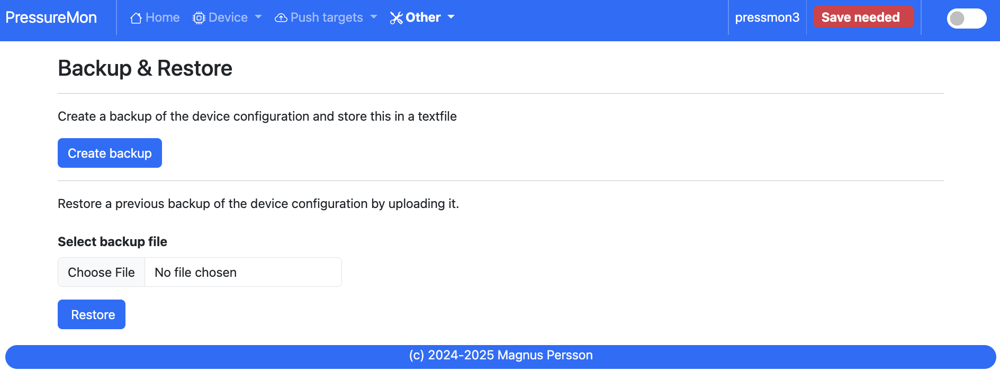

Here you can download a file with all of the device settings and also restore data if needed. Each file is unique for a device which is determined by the field "id". 
Modifying this field will allow you to create a template that can be used on any device. This field is stored in more than one place of the file and all needs to be 
changed for this to work.

When downloading a backup the file will be named **gravitymon<deviceid>.txt**

.. note::

  The gravity formula will be recreated if calibration points are available on the device, so the formula might be different than what is in the file.

Other - Firmware
++++++++++++++++

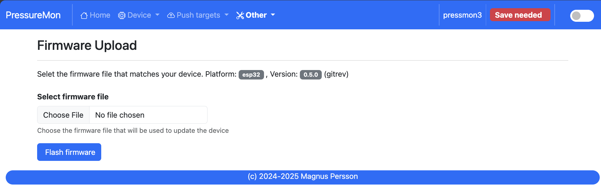

* **Upload Firmware**

  This option gives you the possibility to install an new version of the firmware (or any firmware that uses the standard flash layout).

Other - Support
+++++++++++++++

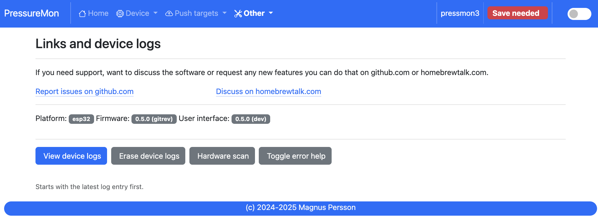

* **View device logs**

  Shows the log entires stored on the device, can also be used to delete the current logs.

Other - Tools
+++++++++++++

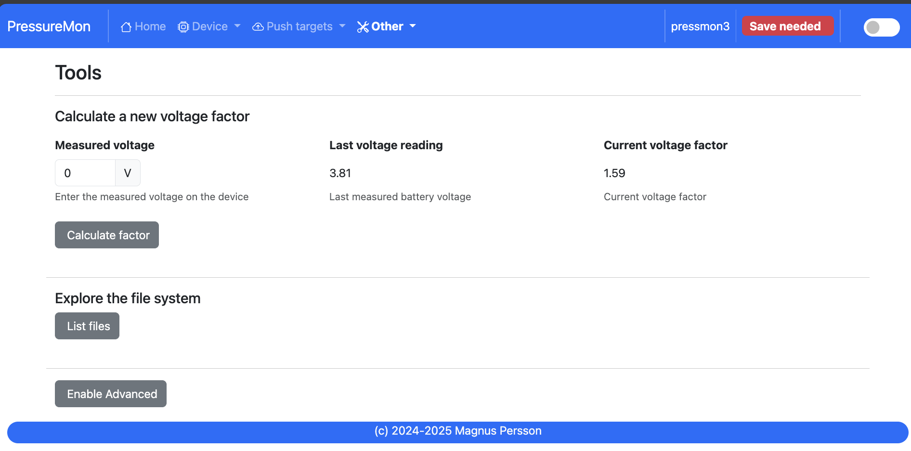

* **Calculate voltage factor**

  Can be used to calculate a new voltage factor based on measured voltage and current readings.

* **List files**

  Shows the files on the device and allows a user to show the contents of those files.

Other - About
+++++++++++++

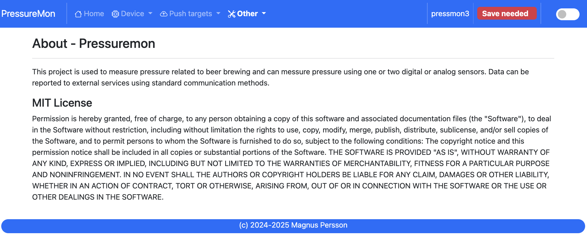

Shows information about the software
