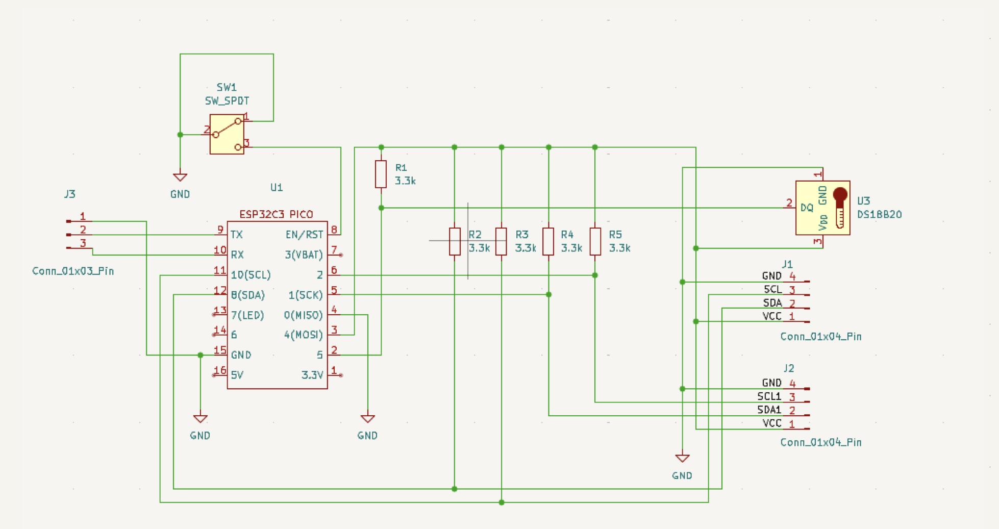
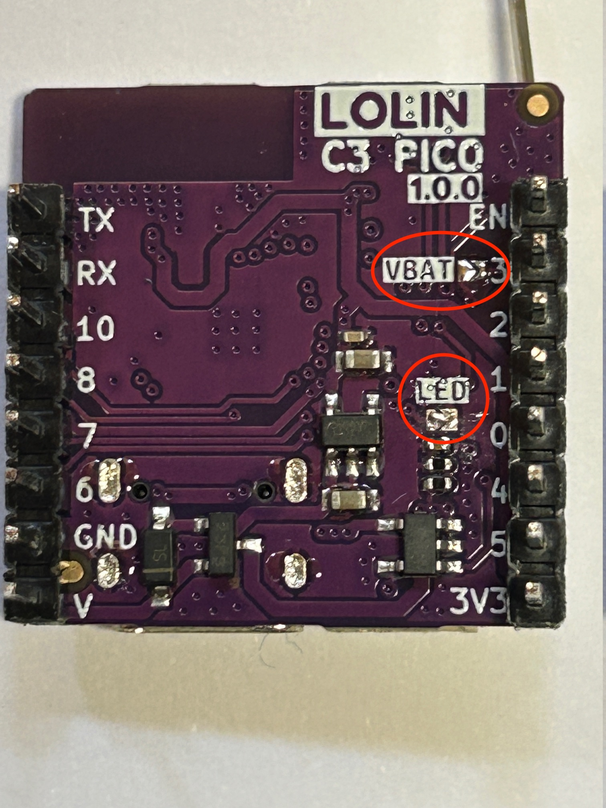
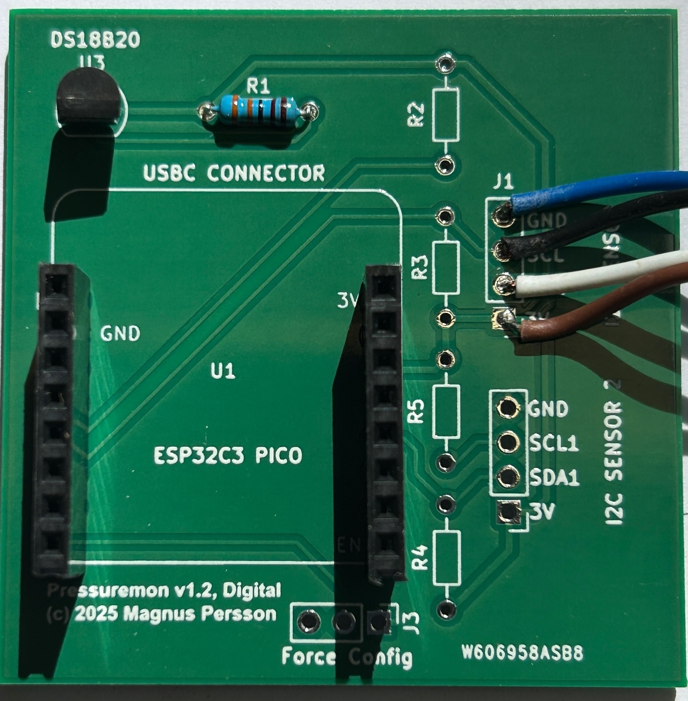

.. _hardware:

Hardware
########

To build the hardware for this project you will need the following. 

* A microcontroller ESP32c3 pico. 
* A digital pressure sensor from the brand XIDIBEI (see aliexpress.com), select one that matches the range you want to measure.
* PCB for mounting the components
* Lithium battery compatible with the ESP32c3 pico (check the battery matches the connector, +/- pins)
* DS18B20 temperature sensor (Needed for temperature data since the internal sensor is not accurate enough)
* 3.3k resistors for the temperature sensor data pullup
* 2 x Small switches for turning the device off and forcing configuration mode

.. note:: 

  There is no need for pullups on the I2C bus since the XIDIBEI sensors already have internal pullups. These are added so that we can 
  support other sensors in the future.

.. note:: 

  ESP32c3 mini, ESP32s2 mini or ESP32s3 mini will also work but will require additional hardware such as LiPo 
  charger and voltage divider for measuring battery. (The s2 does not support bluetooth). If you want to use 
  any of these boards the pinout is the same.

  Some boards only have one I2C hardware controller (ESP32s2 and ESP32c3) so here the second sensor uses a software
  based driver which is slightly slower.

Custom boards
=============

Besides the standard boards listed here (which are tested and verified by me) there is also a possibility 
to add custom boards which are included in the builds and made available through this gihub repository. 
A list of these boards can be found here :ref:`custom-boards`. I cannot take full responsibility for these 
builds since I dont have access to these boards for testing.

Schema for ESP32c3 pico
+++++++++++++++++++++++

Building a device
+++++++++++++++++

.. warning:: 

  The images shown here for the v1.2 prototype pcb and does not include the switch. This is added to the next revision 
  and I will update the images once these are manufactured.

First I would recommend to flash the esp board to make sure that that will work properly before mounting the 
rest of the components. To flash the pci you first need to place it in flash mode which is done by pressing 
the button marked 9 and then pushing the reset button and finally release the 9 button. 

Once flashing has been done then do another reset so the esp will start up. You can then configure the wifi 
and connect the battery to see that you get a valid reading.

Next step is to put some solder on the jumper pads marked LED and VBAT on the back of the board. This will 
enable the battery sensor and LED. Without the VBAT jumper soldered there is no way to measure battery level.

Next step is to solder the other components on the board like the temperature sensor, temp sensor pullup resistor, 
pressure sensor and switch. I would also recommend to add some pins for the force config so that the device can be 
forced into configuration mode if needed.

.. note:: 

  Make sure you use the pins for SENSOR 1 since the software does not yet support the second sensor.

Now you can mount the esp to the pcb and the build is done.

